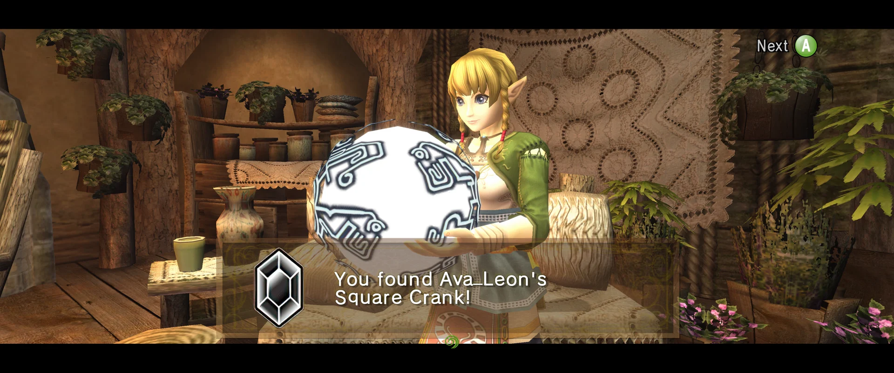
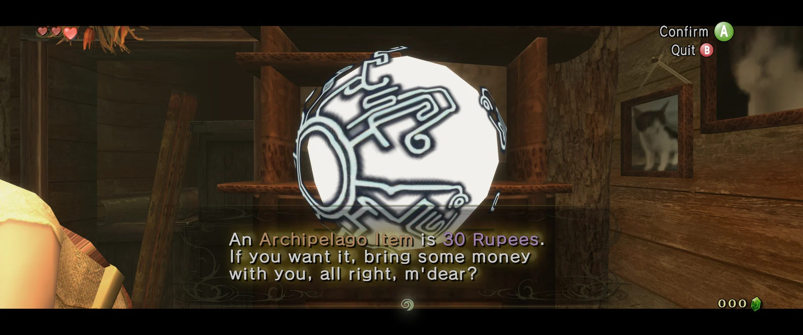
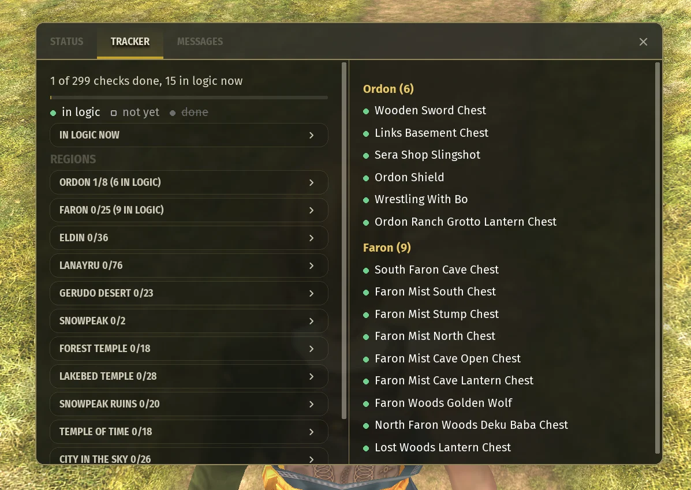
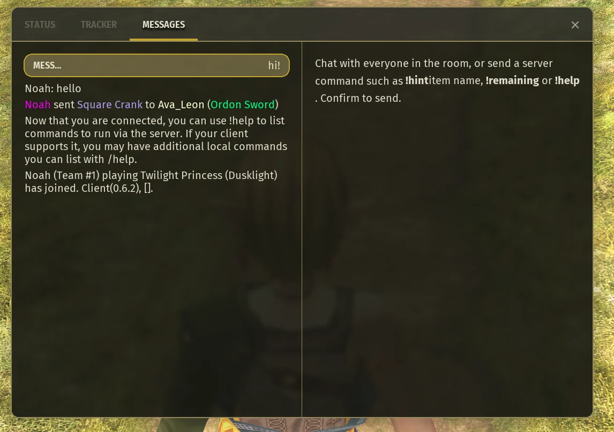
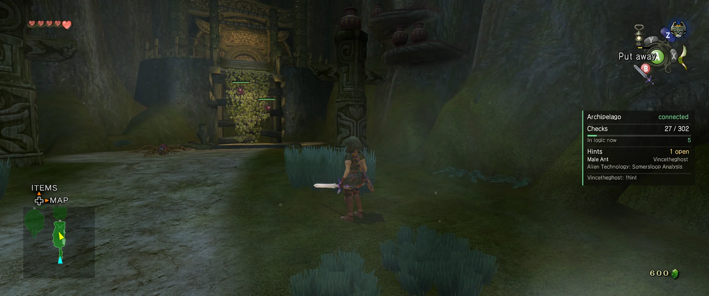
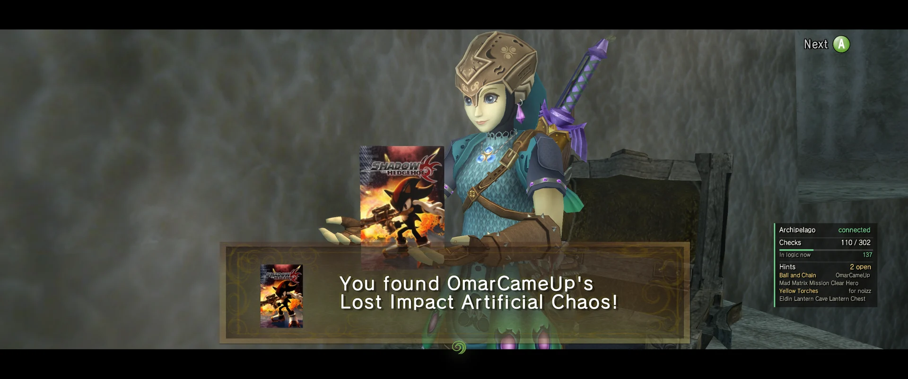

<p align="center">
  
</p>

# Dusklight Archipelago

[Archipelago](https://archipelago.gg) multiworld support for [Dusklight](https://github.com/TwilitRealm/dusklight),
built on top of the [official Dusklight randomizer](https://github.com/TwilitRealm/dusklight-randomizer).

The mod connects to an Archipelago server from inside the game and rebuilds the seed with the
randomizer's own generator, so a multiworld seed plays exactly like a normal randomizer seed:
same logic, stage edits, text, and progressive items.

## Playing

You need three things:

1. **The mod.** Copy `archipelago.dusk` into your Dusklight mods folder:
   - Windows: `%APPDATA%\TwilitRealm\Dusklight\mods`
   - Linux: `~/.local/share/TwilitRealm/Dusklight/mods`
   - macOS: `~/Library/Application Support/TwilitRealm/Dusklight/mods`

   It carries its own copy of the randomizer, so Dusklight's built-in Randomizer doesn't need
   updating or removing; the two don't interfere.
2. **The apworld.** Put `tp_dusklight.apworld` into your Archipelago install's `custom_worlds`
   folder. Whoever generates the multiworld needs it; players who only play need it for the
   tracker and text client.
3. **A YAML.** Start from a preset below, or copy `Template.yaml` from the release — the
   full template with every option explained. You can also generate it
   from the Archipelago Launcher; if you just installed or updated the apworld, restart the
   Launcher first, because it keeps using the apworld it loaded when it started.

Easy, Normal, Hard, Extreme and the template's default have `logic_transform_anywhere` on, so
logic may expect you to transform where NPCs can see you. The game normally refuses that; on
those saves the mod allows it by itself, so there's no Dusklight setting to change.

Then:

1. Start Dusklight. On the Play button, use the arrows to pick **Archipelago**, and start it.
2. Create a **new file**. A connection window opens: enter the server (`archipelago.gg:12345`
   or `localhost:38281`), your slot name from the YAML, and the room password if there is one.
3. Press **Connect and start**. The seed is built from the server's data, which takes a few
   seconds, and then you continue to name entry as usual.
4. Play. Checks are sent as you collect them, and items other players find for you arrive
   automatically. Items belonging to other worlds appear as a Sol (or as their game's box, see
   below) and say who they belong to.

Loading an existing Archipelago save reconnects by itself. If the room moved to a different
port, open the **Archipelago** tab in the menu bar (F1), change the server there, and press
Reconnect. That tab also shows connection status, items received and checks sent.

Anything you collect while disconnected is sent the next time you connect, and items you were
given while away arrive when you load the save.

<p align="center">
  
  
</p>

### Live tp-map

While the mod is enabled, open **http://127.0.0.1:38282/** on the same computer as
Dusklight, or `http://YOUR_IP:38282/` from another device. The
mod serves tp-map and checks off locations as its tracker or the
Archipelago server records them. A save loaded before opening the page is synced
on the first poll; later checks appear within about a second. The page uses
tp-map's existing flag, item tracker, and requirement logic. You can import a
Dusklight spoiler log through tp-map's normal seed import control if you want
its seed settings and item placements shown too.

The server listens on all IPv4 interfaces (`0.0.0.0`) and stops when the mod
unloads. It serves the map and current seed/check progress over unauthenticated
HTTP to devices that can reach that port. Change
**Map port** in the mod's options panel or the Archipelago Status tab to use a
different local port; the address changes immediately and the setting is saved.
If the chosen port is already in use, the mod logs a warning and keeps the
previous listener running (if one was active).

The build bundles tp-map at revision `69efd0401a15c4872efa74218f75915ea7b342f3`;
it uses the `tp-map/` checkout when one is present, or fetches that revision
otherwise. tp-map's existing Leaflet and YAML scripts still load from their
upstream CDNs, so the page needs internet access for those scripts.

### Servers and encryption

Both `ws://` and `wss://` work. The mod handles WebSocket, TLS and `permessage-deflate`
compression itself, so nothing depends on the host's WebSocket support.

Enter the room address as Archipelago gives it (`archipelago.gg:12345`). The mod tries TLS
first for remote servers and plain for `localhost`, falling back to the other if refused. To
force one, include the scheme: `wss://archipelago.gg:12345`.

Certificates are checked against built-in root authorities, and expired, self-signed or
mismatched ones are refused. For a self-hosted server with a self-signed certificate, use
`ws://`.

### Tracker, hints and messages

The **Archipelago** tab (F1) also has:

- **Tracker**: your check progress and what's in logic right now. Pick a region to see all its
  checks. Green dot = in logic, hollow = not yet, gray and crossed out = done. It uses the
  seed's own logic, so it matches Archipelago. The save must have connected to its room, which
  it does on load.
- **Hints**: every hint involving you, meaning where your items are and which of other players'
  items are in your world. It shows your hint points and the cost of a hint, and lets you
  request hints by item or location. You can mark hints for your own items as Priority, No
  priority or Avoid. New hints pop up as they arrive.
- **Messages**: the room log, newest first, in Archipelago's colors. You can chat or send server
  commands like `!remaining`. Emoji render as images, and the Emoji button inserts codes like
  `:joy:`.

<p align="center">
  
  
</p>

**Death link**: Set `death_link: true` to share deaths with everyone in the multiworld who has it on. A bottled
fairy still saves you from a received death, and a fairy save doesn't send one. A death that
arrives during a cutscene or conversation waits until it ends. You can toggle death link per
save in the **Archipelago** tab (F1).

### Overlay

The **Overlay** page turns on an on-screen panel drawn in the game's HUD, hidden whenever the HUD
is. Choose what it shows (connection status, checks and logic, received items, open hints,
recent chat, death link) and set its position, edge distance, size and background. It's off by
default.

<p align="center">
  
</p>

### Game boxes

Another Twilight Princess (Dusklight) player's item shows that item's model when one is
available. This changes only its appearance: the item still goes to its owner, and your
inventory does not gain it. Items without a usable model keep the normal Archipelago
appearance.

Other games' items can appear as their game's box art instead of a Sol. Covers come from
[SteamGridDB](https://www.steamgriddb.com) using your free API key (sign in, then Preferences →
API). The mod asks on first play, and you can change it later under **Other players' items** on
the Status page (F1). Covers download once to `randomizer/archipelago/covers`. Other games'
items stay Sols when no cover or API key is available. For custom art, put
a PNG or JPG named after the game (as the room lists it) in
`randomizer/archipelago/covers/custom`.

<p align="center">
  
</p>

Picking up another player's item plays a jingle based on its classification: the item fanfare
for progression, the heart-piece jingle for useful, the rupee jingle for filler, and the save
menu's "No" sound for traps.

### Collect Dungeon on Completion

Set `collect_dungeon_on_completion: true` and beating a dungeon's boss collects every remaining
check there. Other players get their items immediately, and yours arrive without fanfares, with
one pop-up listing them. Chests you open afterwards hold a green rupee. This triggers on the
boss's heart container or the dungeon reward, whichever comes first. Hyrule Castle is skipped,
since its boss is the goal.

## Presets

`presets/` has seven YAMLs, each verified to generate and rebuild exactly in the in-game
generator. The first four scale up in length and difficulty, and the last three are the full
game at rising difficulty. Check counts are averages, since which dungeons stay unshuffled
varies per seed.

| Preset | Checks | Difficulty | What it is |
| --- | --- | --- | --- |
| Easy | ~150 | Easy | Prologue, Midna's Desperate Hour and all three twilights done; overworld chests and freestanding items plus one dungeon; plentiful pool, no traps, castle open. |
| Normal | ~200 | Normal | Prologue skipped, twilights mostly intact, keys move between dungeons, hidden skills shuffled, three dungeons, a few traps, castle wants four dungeons. |
| Hard | ~300 | Hard | Nothing skipped, keys anywhere, golden bugs, sky characters, hidden skills and shops shuffled, six dungeons, many traps, double damage. |
| Extreme | ~450 | Extreme | Hard plus a minimal pool, one-hit kills, bonks that hurt, traps everywhere, eight dungeons, and a castle that wants all eight dungeons and all 60 poe souls. |
| Ultimate | ~570 | Normal | Every possible check (all nine dungeons, every bug, sky character, gift, shop item, hidden skill, rupee and poe) at Normal's difficulty. |
| Hero of Twilight | ~570 | Hard | Every possible check at Hard's difficulty. |
| Hero of Time | ~570 | Hardest | Every possible check with Extreme's punishment, and every piece of junk replaced by a trap. |

Easy through Extreme start you with the Shadow Crystal and allow transforming in front of NPCs
(see above). Ultimate, Hero of Twilight and Hero of Time make you find the crystal and follow
the game's normal transform rules.

Every preset keeps other players' important items out of Hyrule Castle (see below). Easy, Normal
and Hard also raise `progression_balancing` (90, 80, 70) so your progression shows up earlier.

Copy a preset into your Archipelago `Players` folder and set `name:` to your slot name.

## Options

Options are generated from the randomizer's settings, so their names match the in-game menus,
and the template explains each one.

Unset options maximize checks: every shuffle is on, every poe soul is a check, and dungeon items
stay in their own dungeon. For a shorter run, start from a preset.

**Shuffled Dungeons** (0–9) sets how many dungeons are shuffled into the multiworld. The rest,
chosen randomly per seed, stay vanilla. You still play them and logic still needs their items,
but they aren't checks. The spoiler log lists which dungeons stayed vanilla.

**Every preset excludes Hyrule Castle.** It's the final dungeon, so items there would leave
other players waiting on your whole run. Excluded checks still exist but never hold an item
another player needs (a dungeon's own keys can still be there if keys stay in their dungeon).
Each dungeon is a location group, e.g. `exclude_locations: [Hyrule Castle, Palace of Twilight]`.
The template excludes nothing.

A few options are fixed by this world:

- **Entrance randomization** and **randomized starting spawn** are off. The in-game generator
  only sees your world, so it can't place entrances consistently with the multiworld yet.
- **In-game hints** (hint signs, Midna hints) are off because the randomizer can't see other
  worlds. Use Archipelago's hints instead.
- **Unrequired dungeons are barren** is off, and logic is always "all locations reachable".

## Building

Want to contribute? [CONTRIBUTING.md](CONTRIBUTING.md) covers setup, tests and pull requests, and
[docs/ARCHITECTURE.md](docs/ARCHITECTURE.md) explains how it all works.

```sh
git clone https://github.com/noahsmaximum/dusklight-archipelago
cd dusklight-archipelago
cmake -B build
cmake --build build --parallel
```

`build/mods/archipelago.dusk` is the mod. Build the apworld with:

```sh
python tools/build_apworld.py          # writes build/tp_dusklight.apworld
python tools/build_apworld.py --install <Archipelago>/custom_worlds
```

The apworld vendors the randomizer's own YAML data (`generator/data`) and implements the same
logic in Python, so its locations, items and rules stay in step with the mod. Re-run
`tools/build_apworld.py` after changing anything under `generator/data`.

`tools/ap_gen_test.cpp` builds an `ap_gen_test` executable that rebuilds a seed from a saved
`slot_data.json` exactly like the mod does, which is the quickest way to check generation
changes without launching the game.

`tools/tls_test.cpp` builds a `tls_test` executable that drives the mod's TLS client
(`src/ap/tls.cpp`) over ordinary sockets against real servers, checking both that valid
certificates are accepted and that expired, self-signed, untrusted and mismatched ones are
refused. Run it with no arguments for the default suite.

The trusted roots in `src/ap/ca_bundle.pem` come from
[curl.se/docs/caextract.html](https://curl.se/docs/caextract.html) (Mozilla's list). Replace
that file to refresh them; nothing else needs to change.

## Credits

The randomizer, its logic data and its generator are by [Twilit Realm](https://github.com/TwilitRealm).
This fork adds the Archipelago game mode, the network client and the apworld.

Emoji graphics are [Twemoji](https://github.com/jdecked/twemoji), licensed under
[CC-BY 4.0](https://creativecommons.org/licenses/by/4.0/) (see `res/emoji/LICENSE.txt`), and the
emoji font is [Twemoji Mozilla](https://github.com/mozilla/twemoji-colr) (Apache 2.0, graphics
CC-BY 4.0; see `res/fonts/LICENSE.txt`). Images are decoded with
[stb_image](https://github.com/nothings/stb) (public domain). Box art comes from
[SteamGridDB](https://www.steamgriddb.com) at play time and isn't part of this project.

## AI disclosure

This fork's code, apworld and documentation were written/assisted with Claude Code. I, NoahsMaximum have been directing, reviewing and play-testing every version.
The randomizer is built off of TwilitRealm's randomizer. Every release goes through manual and automated tests (each preset's
seeds rebuilt in the game's own generator and compared exactly, the TLS and compression suites,
builds on every platform), but not every change has been played in game before release, so
edge-case bugs might get through. Please [open an issue](https://github.com/noahsmaximum/dusklight-archipelago/issues) if you find anything.
